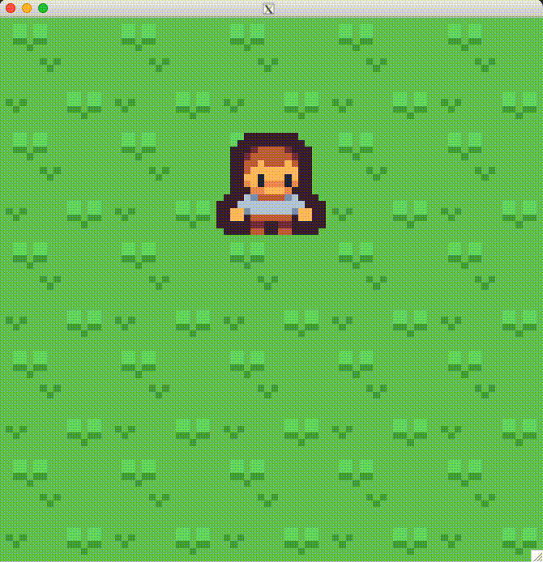

# {tilebased}

<!-- badges: start -->

<!-- badges: end -->

Use your keyboard to move a player sprite around a procedurally-generated map. In an R graphics window.

Just for fun. Not possible without Mike Cheng's [{nara}](https://coolbutuseless.github.io/package/nara/index.html) and [{eventloop}](https://coolbutuseless.github.io/package/eventloop/index.html), as well as [Kenny's assets](https://www.kenney.nl/). Based partially on [{r.oguelike}](https://github.com/matt-dray/r.oguelike/).

Install with `remotes::install_github("matt-dray/tilebased")` and then `tilebased::play()`. Michaelsoft Binbows not supported.

